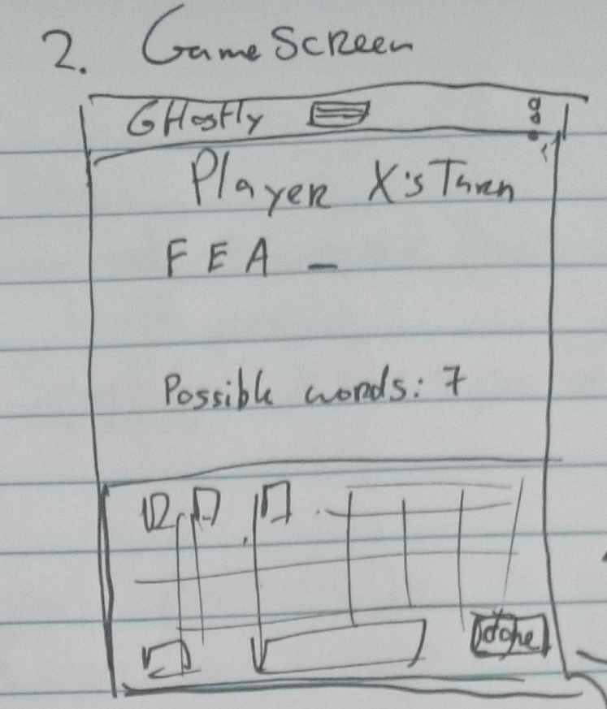
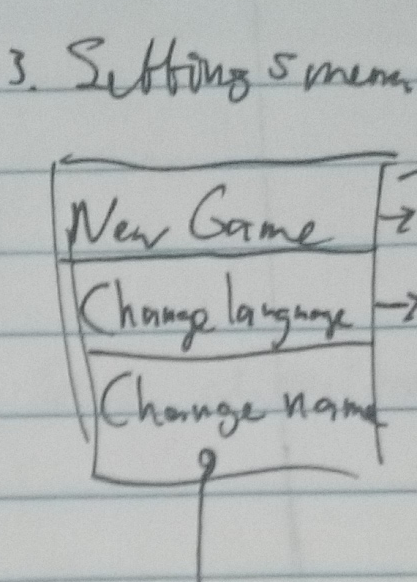
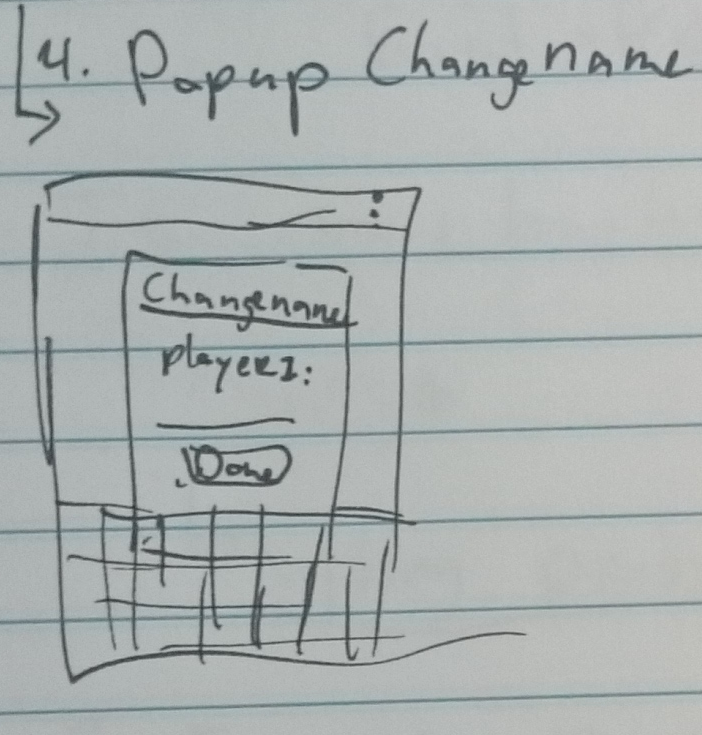
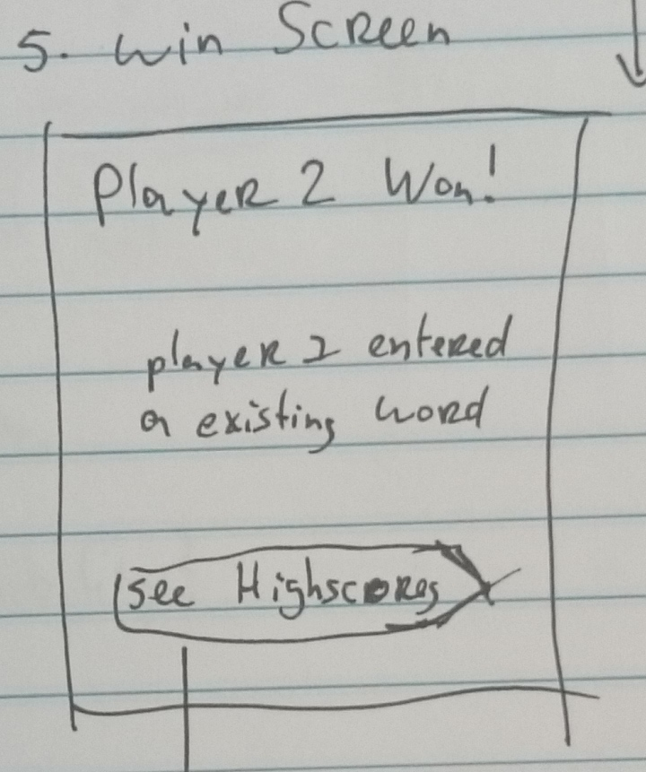
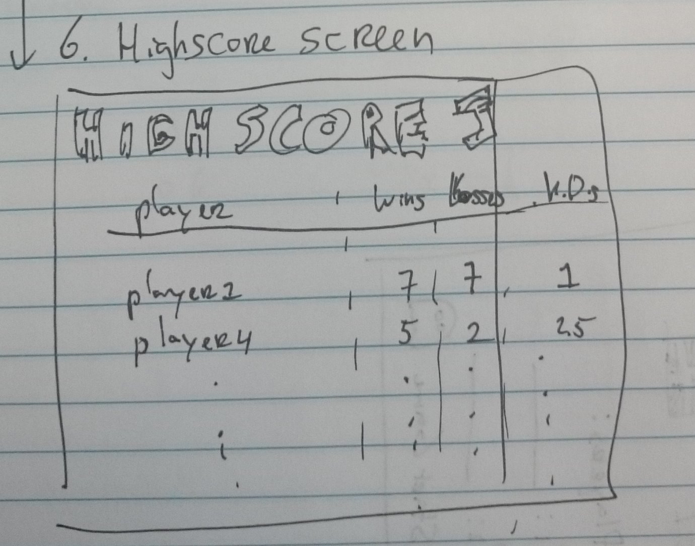
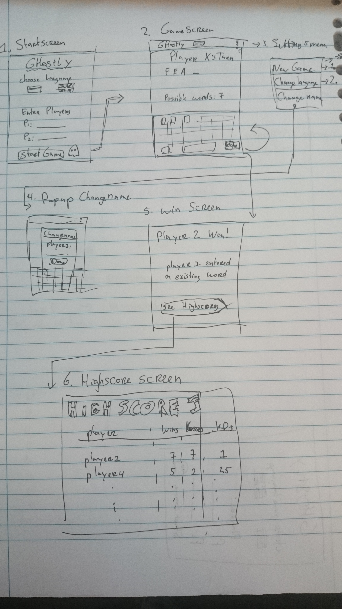

# Title: Ghostly

## Summary
The Ghost word guessing game now available for all Android devices. Play with your friends and take turns choosing letters. The first to form an existing word loses!

## Features 
1. Multiple languages supported
2. Choose your own custom player names
3. Saves all previous players and their results
4. Game is saved when you close the app
5. See highscores of all the plays so far on your phone

## Activity Sketches

# Classes with data and public functions

## Libraries
None
